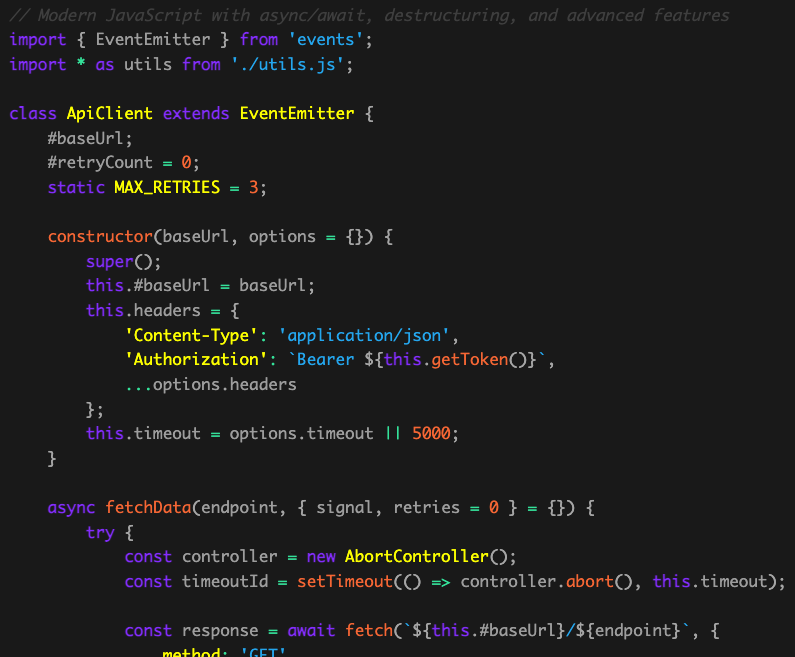

# Hui Prism Theme - Documentation & Examples

<div align="center">
  
</div>

This documentation provides live examples and comprehensive testing for the Hui Prism theme with various code examples and interactive features.

## 🚀 Quick Access

- **Live Demo**: [View on GitHub Pages](https://huement.github.io/hui-prism/)
- **NPM Package**: `@huement/hui-prism`
- **Repository**: [GitHub](https://github.com/huement/hui-prism)

## Features

- **Multiple Language Examples**: JavaScript, Python, CSS/SCSS, HTML, JSON, Bash, TypeScript
- **Theme Switching**: Toggle between development and production builds
- **Copy to Clipboard**: Easy code copying functionality
- **Responsive Design**: Works on all screen sizes
- **Accessibility**: Full keyboard navigation and screen reader support
- **Performance Monitoring**: Built-in performance tracking

## Local Development

### Quick Start

```bash
# Build theme and start docs server
npm run docs

# Or build and open in browser automatically
npm run docs:open
```

### Manual Setup

```bash
# Build the theme first
npm run build:dev

# Start a local server in the docs directory
cd docs
python3 -m http.server 8080

# Open in browser
open http://localhost:8080
```

## Keyboard Shortcuts

- `Ctrl/Cmd + D` - Switch to Development theme
- `Ctrl/Cmd + P` - Switch to Production theme
- `Escape` - Close notifications

## File Structure

```
docs/
├── index.html          # Main documentation page
├── docs.css            # Documentation-specific styles
├── docs.js             # Interactive functionality
└── README.md           # This file
```

## Testing Different Themes

The documentation automatically loads the latest built theme from `../dist/theme.css`. To test different theme variants:

1. Build the desired theme variant:
   ```bash
   npm run build:dev    # Development build
   npm run build:prod   # Production build
   ```

2. Use the theme switcher buttons in the documentation interface

3. Or use keyboard shortcuts for quick switching

## Code Examples

The documentation includes comprehensive examples for:

- **JavaScript**: Modern ES6+ features, async/await, classes
- **Python**: Type hints, dataclasses, async programming
- **CSS/SCSS**: Custom properties, modern selectors, responsive design
- **HTML**: Semantic markup, accessibility features
- **JSON**: Configuration files, API responses
- **Bash**: Shell scripting, error handling
- **TypeScript**: Interfaces, generics, utility types

## Browser Support

- Chrome 88+
- Firefox 85+
- Safari 14+
- Edge 88+

## GitHub Pages

This documentation is automatically deployed to GitHub Pages when changes are pushed to the main branch. The GitHub Actions workflow:

1. Builds the theme CSS files
2. Deploys the entire repository to GitHub Pages
3. Makes the documentation available at `https://huement.github.io/hui-prism/`

## Notes

- The documentation uses CDN-hosted Prism.js for syntax highlighting
- Theme switching is handled via JavaScript for dynamic testing
- All examples are real-world code snippets for authentic testing
- Performance metrics are logged to the browser console